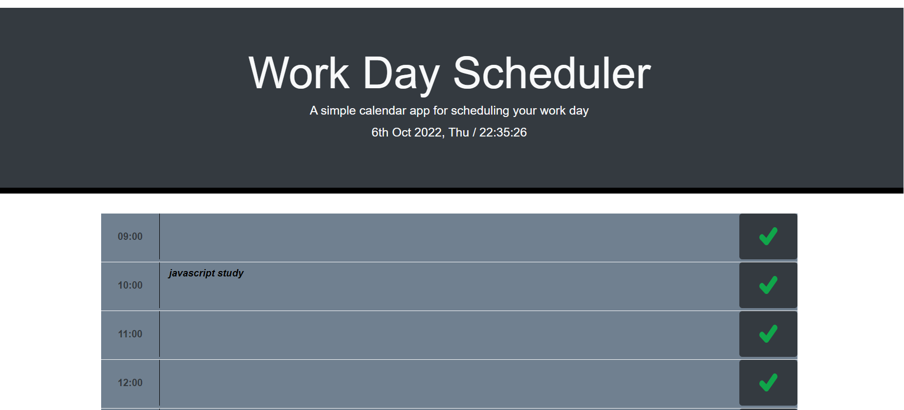

# Work Day Scheduler Application

## Summary
A scheduler application for busy employees looking to schedule events through their work day (from 9:00 to 17:00) and view these scheduled events at a later time. The current day and time is displayed at the top of the application. Hours of the day are color coded to reflect whether it is in the past, present, or future. Scheduled events are stored in the local storage, so that even when the user refreshes the webpage each hour block still shows the event that was scheduled for that time. 





## Code Snippet
```
function colorChange() {
    var currentHour = moment().hour();
   
    for(var i=9; i<=17; i++){
        if (currentHour > i) {
            $('#time'+i).css('background-color', 'slategray');
        }
        else if (currentHour < i) {
            $('#time'+i).css('background-color', 'mediumseagreen');
        }
        else {
            $('#time'+i).css('background-color', 'darkseagreen');
        }   
    }

```

## Technologies Used
<ul>
  <li><b>HTML</b></li>
  <li><b>CSS</b></li>
  <li><b>JavaScript<b></li>
  <li><b>Moment.js<b></li>
  <li><b>Bootstrapt<b></li>
  <li><b>JQuery<b></li>
  <li><b>Git</b></li>
  <li><b>GitHub</b></li>
  <li><b>Google Chrome</b></li>
 </ul>
 
 ## Deployed Link
[ Work Day Scheduler](https://mehmetmusabeyoglu.github.io/Work-Day-Scheduler-Code-Refactor/)
 
 ## Credits
 N/A
 
 ## Author Links
 [LinkedIn](https://www.linkedin.com/in/mehmet-musabeyo%C4%9Flu-788758a8/)
 <br>
 [GitHub](https://github.com/MehmetMusabeyoglu) 
 
 ## License 
 This project is licensed under the MIT License 
 <br>
 [](https://opensource.org/licenses/MIT)
